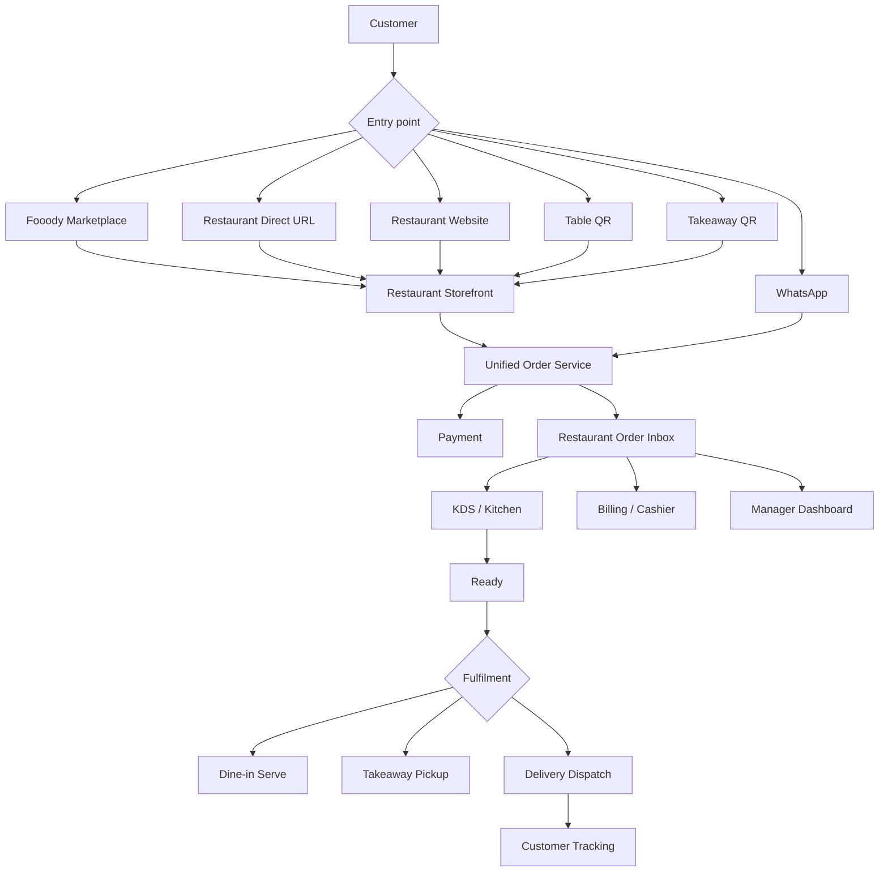

# Fooody.in — Product & Engineering Revamp Master Plan

**Date:** 21 September 2026  
**Goal:** Turn Fooody from a mixed marketing/demo experience into one production food-ordering platform that supports:
1. A consumer marketplace similar in interaction model to mainstream food-delivery apps.
2. Direct restaurant ordering through `fooody.in/[slug]`, restaurant websites, subdomains and QR codes.
3. Dine-in QR ordering, takeaway, delivery and counter/POS orders.
4. One restaurant order-management system for billing, kitchen and management staff.
5. A restaurant-friendly commercial model centered on reducing aggregator dependency and preserving direct customer relationships.

---

# 1. Product Positioning

Fooody should not be presented primarily as a "restaurant commission-saving website" on the consumer homepage.

The consumer product should be:

> **Discover restaurants. Order food. Pay less in unnecessary platform charges.**

The restaurant product should be:

> **One ordering system for your website, QR, takeaway, delivery, WhatsApp and Fooody marketplace.**

These are two different value propositions served by the same platform.

## Consumer promise

- Browse restaurants near the customer.
- Search food, cuisines and restaurants.
- Order delivery, takeaway or dine-in where available.
- See transparent pricing and fees.
- Track orders.
- Reorder easily.
- Use one Fooody account/phone number across restaurants.

## Restaurant promise

- Branded direct ordering page.
- QR dine-in ordering.
- Takeaway ordering.
- Marketplace discovery.
- Unified POS/order inbox.
- Kitchen Display System.
- Billing/payment visibility.
- Customer history and CRM.
- Inventory and menu management.
- Delivery-provider integrations.
- Direct channels with 0% commission by default.
- Subscription-based software rather than a large percentage tax on direct orders.

---

# 2. Correct Product Structure

Fooody has two acquisition paths but only one commerce engine.



There must never be a separate "marketing cart" and "real cart".

---

# 3. Homepage Revamp

## Current problem

The homepage immediately mixes:
- consumer ordering,
- restaurant-owner acquisition,
- commission messaging,
- a claim-your-URL funnel,
- static demo dishes.

That makes the product look like a restaurant SaaS landing page wearing a food-delivery UI.

## New consumer homepage

### Header
- Fooody logo
- Delivery location selector
- Search
- Offers
- Orders
- Sign in / account
- Small secondary link: **Partner with Fooody**

### Hero
Primary headline:

> **Good food from restaurants near you.**

Subtext:

> Delivery, takeaway and dine-in ordering with transparent prices and no unnecessary platform fee.

Primary interaction:
- Location field
- Search field: "Search restaurants, dishes or cuisines"

Do **not** place restaurant commission messaging in the main hero.

### Homepage sections

1. Cuisine/category carousel
2. Restaurants near you
3. Fast delivery
4. Kerala favourites
5. Top rated
6. New on Fooody
7. Offers
8. Dine-in nearby
9. Takeaway nearby
10. Recently ordered / reorder for signed-in customers
11. Small restaurant-owner acquisition strip near the bottom
12. Footer

### Restaurant card

Each card should show:
- image/cover
- restaurant name
- rating
- cuisine
- ETA
- distance
- delivery fee
- minimum order if applicable
- open/closed
- offer badge
- "Direct price" badge only when the claim is verifiably true

Avoid showing invented "aggregator prices" unless there is a reliable source for those prices.

---

# 4. Restaurant Storefront

Canonical routes:

- `fooody.in/[slug]`
- `[slug].fooody.in` → rewrite to same storefront
- restaurant custom domain → same storefront
- `fooody.in/[slug]/table/[tableNumber]`
- `fooody.in/[slug]/kiosk`

## Storefront header

- restaurant cover/logo
- restaurant name
- rating
- cuisine
- location
- open/closed
- ETA
- delivery/takeaway/dine-in availability
- restaurant information
- search menu

## Menu experience

- sticky category navigation
- search
- veg/non-veg filters
- bestseller badges
- variants
- modifier groups
- item image
- item description
- availability
- quantity control
- recommended add-ons

## Fulfilment selector

For a normal direct URL:
- Delivery
- Takeaway
- Dine-in only if appropriate

For a table QR:
- fulfilment is locked to Dine-in
- restaurant and table are locked
- no delivery address

For a takeaway QR:
- fulfilment is locked to Takeaway

For marketplace:
- usually Delivery or Takeaway

---

# 5. Cart Rules

Fooody can list many restaurants, but one checkout should belong to one restaurant.

If a customer adds an item from Restaurant B while Restaurant A is in the active cart:

> "Your cart contains items from Restaurant A. Start a new cart for Restaurant B?"

Actions:
- Keep current cart
- Start new cart

Do not introduce cross-restaurant combined checkout in the first production version.

Why:
- different kitchens
- separate GST invoices
- separate preparation SLAs
- separate payouts
- separate refunds/cancellations
- potentially separate riders
- much harder support flow

---

# 6. Checkout

Checkout must adapt to fulfilment type.

## Delivery

Required:
- name
- phone
- address
- map pin / coordinates
- delivery instructions
- payment method
- coupon
- price breakdown

Optional:
- schedule order

## Takeaway

Required:
- name
- phone
- pickup time / ASAP
- payment method

No delivery address.

## Dine-in QR

Required:
- table identity from signed QR/session
- optional customer phone depending on restaurant policy
- payment choice:
  - Pay now
  - Pay at counter/table

No delivery information.

## Price breakdown

Always display:
- item subtotal
- discount
- tax
- packaging if actually charged
- delivery fee
- payment/gateway charge if legally and commercially appropriate
- platform fee
- total

The interface must not hide fees.

---

# 7. Order Source vs Fulfilment Type

The current data model concept should be corrected.

Do not use one enum to represent both acquisition source and fulfilment.

## OrderSource

```ts
enum OrderSource {
  MARKETPLACE
  DIRECT_WEB
  TABLE_QR
  TAKEAWAY_QR
  WHATSAPP
  POS
  KIOSK
  API
}
```

## FulfillmentType

```ts
enum FulfillmentType {
  DELIVERY
  TAKEAWAY
  DINE_IN
}
```

## DeliveryMode

```ts
enum DeliveryMode {
  NONE
  IN_HOUSE
  UBER_DIRECT
  PORTER
  FOOODY_POOL
}
```

This makes reporting and operations much clearer.

Example:

```txt
source = DIRECT_WEB
fulfillmentType = DELIVERY
deliveryMode = PORTER
```

or

```txt
source = TABLE_QR
fulfillmentType = DINE_IN
deliveryMode = NONE
```

---

# 8. Unified Order Lifecycle

Use one domain service for every order.

## Commercial order status

```txt
DRAFT
PENDING
ACCEPTED
PREPARING
READY
COMPLETED
CANCELLED
REJECTED
```

## Fulfilment status

Delivery:

```txt
NOT_REQUIRED
AWAITING_DISPATCH
RIDER_ASSIGNED
PICKED_UP
IN_TRANSIT
DELIVERED
FAILED
```

Takeaway:

```txt
AWAITING_PREPARATION
READY_FOR_PICKUP
PICKED_UP
```

Dine-in:

```txt
OPEN
IN_PREPARATION
READY_TO_SERVE
SERVED
BILLED
CLOSED
```

Payment state must remain independent:

```txt
PENDING
AUTHORIZED
PAID
CASH_ON_DELIVERY
FAILED
REFUNDED
PARTIALLY_REFUNDED
```

Separating these state machines avoids hacks such as using `DISPATCHED` for dine-in orders.

---

# 9. Restaurant Order Intake — Critical Staff Experience

The restaurant must never miss an order.

## Incoming order screen

A new order should trigger:

- prominent full-width/new-order card
- repeating sound until acknowledged
- browser/PWA notification
- flashing/attention state
- order source badge
- fulfilment badge
- order number
- elapsed time since order placed
- customer/table
- items
- special instructions
- payment status
- accept/reject buttons
- prep-time selector

Example:

```txt
#1427
MARKETPLACE • DELIVERY
Paid • ₹742
Received 00:38 ago

2 × Chicken Biryani
1 × Lime Juice
No onions

[Reject] [Accept • 25 min]
```

## Acceptance SLA

Recommended:
- first loud notification immediately
- repeat after 30 seconds
- manager escalation after configurable threshold
- restaurant may configure auto-accept only after operational maturity

If a store stops responding:
- temporarily mark it unavailable to new marketplace orders
- continue showing direct storefront with an availability message if appropriate
- alert owner/manager

---

# 10. POS / Order Inbox

Create one operational screen with filters:

### Tabs
- New
- Accepted
- Preparing
- Ready
- Delivery
- Dine-in
- Takeaway
- Completed
- Cancelled

### Filters
- source
- fulfilment
- payment
- staff
- date/time
- order number
- customer phone

### Source badges
- Fooody
- Direct
- QR
- WhatsApp
- POS
- Kiosk

Restaurant staff should immediately understand where demand is coming from.

---

# 11. Kitchen Display System

KDS should focus only on preparation.

Columns:

```txt
NEW → PREPARING → READY
```

Each kitchen ticket:
- order number
- table / takeaway / delivery
- elapsed time
- items grouped cleanly
- modifiers
- notes
- course/category if later supported
- priority
- overdue indicator

Actions:
- Start
- Ready

Kitchen should not need payment, CRM or marketing controls.

---

# 12. Billing / Cashier Experience

Cashier role needs:

- open orders
- unpaid orders
- table bills
- takeaway bills
- cash collection
- UPI confirmation
- card/manual terminal collection
- refund/cancellation escalation
- invoice printing
- KOT printing
- reprint with audit reason

For dine-in:
- show running table bill
- allow additional order rounds
- settle once
- close table after payment

---

# 13. Fix Table Sessions

A dine-in table session should represent the entire table visit.

Recommended relationship:

```txt
DiningTable
  ↓
TableSession
  ↓
many Orders
  ↓
many OrderItems
```

Do not close the table session after the first order.

Flow:

```txt
Scan QR
→ create/find OPEN TableSession
→ order round 1
→ kitchen
→ customer adds more items
→ order round 2
→ kitchen
→ request bill
→ combine session totals
→ payment
→ CLOSED
→ table VACANT
```

This is essential for real restaurant use.

---

# 14. Notifications

Use layered notification delivery.

## Restaurant staff
1. live order stream
2. sound
3. browser/PWA push
4. fallback WhatsApp/SMS escalation for unanswered orders
5. optional printer/KOT

## Customer
- order placed
- restaurant accepted
- preparing
- ready
- rider assigned
- out for delivery
- delivered
- pickup ready
- dine-in served/bill requested

Channels:
- in-app
- WhatsApp
- optional SMS
- web push later

Do not make WhatsApp the only operational dependency.

---

# 15. Marketplace Location

The location selector must become real.

Customer location should affect:

- restaurant visibility
- distance
- delivery eligibility
- ETA
- delivery fee
- open status
- ranking

Create:

```txt
RestaurantDeliveryZone
- restaurantId
- zoneType
- radiusKm or polygon
- minOrderPaise
- deliveryFeePaise
- freeDeliveryAbovePaise
- estimatedMinutes
```

The marketplace should never show a restaurant as orderable when the customer is outside its service area.

---

# 16. Search & Ranking

Search across:
- restaurant name
- cuisine
- menu item
- tags
- area

Ranking inputs:
- delivery eligibility
- open now
- ETA
- rating
- relevance
- popularity
- conversion
- distance
- promoted placement

Advertising must never override basic eligibility.

---

# 17. Menu — One Source of Truth

Delete the conceptual separation between:
- marketing/demo dishes
- restaurant database menu

Every consumer surface should read from the same menu service.

```txt
Prisma/Postgres
      ↓
Public Menu Service
      ↓
Marketplace
Restaurant Storefront
QR Menu
Kiosk
WhatsApp
POS
```

Menu updates should appear everywhere.

---

# 18. Restaurant Onboarding

The "claim your URL" flow should create a real onboarding record.

## Step 1
- restaurant name
- phone
- email
- city
- preferred slug

## Step 2
- OTP verification

## Step 3
- restaurant details
- address
- map location
- cuisine
- GST details if applicable

## Step 4
- fulfilment options
- delivery radius
- opening hours

## Step 5
- payment details
- UPI/bank settlement data

## Step 6
- menu import
  - manual
  - CSV
  - assisted onboarding

## Step 7
- QR and storefront generated

## Step 8
- staff accounts

## Step 9
- test order

## Step 10
- go live

`fooody.in/[slug]` should be reserved only after the server confirms it.

---

# 19. Staff Accounts

Existing invite behavior must be completed.

Roles:

- OWNER
- MANAGER
- KITCHEN_STAFF
- BILLING_CASHIER
- DELIVERY_DRIVER
- optional FLOOR_STAFF

Invitation:
- owner enters phone/email
- staff receives secure invite
- sets password or uses OTP
- membership activated
- audit event created

No production account should depend on seeded passwords.

---

# 20. Customer Identity

For v1, browsing should not require login.

At checkout:
- phone verification can establish customer identity
- allow guest-like frictionless ordering

Suggested models:

```txt
Customer
- id
- phone
- name
- email?
- createdAt

CustomerAddress
- customerId
- label
- line1
- area
- city
- lat
- lng

RestaurantCustomer
- restaurantId
- customerId
- firstOrderAt
- lastOrderAt
- totalOrders
- totalSpendPaise
```

RestaurantCustomer gives the restaurant useful direct-channel CRM without duplicating identities.

---

# 21. Payments

Production payment flow:

```txt
Checkout
→ create Fooody order
→ create gateway order/session
→ customer pays
→ gateway callback/webhook
→ verify signature
→ idempotently update Payment
→ notify restaurant/customer
```

Requirements:
- payment create endpoint
- signature verification
- webhook idempotency
- refund flow
- payment reconciliation
- unique gateway reference
- failure/retry UI
- COD where restaurant allows it

Never accept payment webhooks when the signing secret is missing.

---

# 22. Order Tracking Security

Do not expose personal order data using only a guessable/raw order ID.

Use one of:
- cryptographically random public tracking token
- signed expiring token
- authenticated customer session

Example:

```txt
/track/tk_Hp8x...random...
```

Public tracking response should reveal only information required for the customer order.

---

# 23. Delivery

Delivery is a fulfilment service, not the order itself.

Adapter interface:

```ts
interface DeliveryProvider {
  quote(input): Promise<DeliveryQuote>;
  createDelivery(input): Promise<DeliveryJob>;
  cancelDelivery(jobId): Promise<void>;
  getStatus(jobId): Promise<DeliveryStatus>;
}
```

Providers:
- IN_HOUSE
- UBER_DIRECT
- PORTER
- FOOODY_POOL

Restaurant settings choose:
- default delivery provider
- fallback provider
- maximum radius
- markup/pass-through rules

Marketplace checkout should obtain a delivery quote before final payment where required.

---

# 24. Commercial Model

Keep fees explicit by channel.

## Direct restaurant channels

Recommended default:
- 0% commission
- subscription fee
- payment-gateway fees as applicable
- delivery cost if restaurant requests third-party delivery

Direct channels:
- restaurant link
- subdomain
- custom website
- table QR
- takeaway QR
- WhatsApp

## Fooody marketplace

Keep commercial terms configurable.

Possible fields:
- marketplaceCommissionBps
- fixedOrderFeePaise
- subscription plan
- promo subsidy
- delivery subsidy

Do not bake business-policy percentages into UI code.

---

# 25. Restaurant Dashboard

Owner dashboard:

### Today
- gross sales
- net sales
- orders
- average order value
- cancelled orders
- acceptance rate
- average acceptance time
- average prep time

### Channel breakdown
- marketplace
- direct web
- QR
- WhatsApp
- POS

### Fulfilment breakdown
- delivery
- takeaway
- dine-in

### Customer
- new
- returning
- repeat rate

### Operations
- low stock
- unavailable items
- delayed orders
- failed payments
- delivery issues

### Growth
- direct-order share
- coupon performance
- top items
- abandoned carts later

---

# 26. Customer Reviews

For marketplace trust, introduce verified-order reviews.

```txt
Review
- orderId unique
- customerId
- restaurantId
- rating
- foodRating?
- deliveryRating?
- comment?
- createdAt
- moderatedAt?
```

Only completed orders can review.

Ratings shown on restaurant cards should come from real completed-order feedback.

---

# 27. Availability

Restaurant status should combine:

- opening hours
- temporary pause
- kitchen load
- delivery capacity
- holiday override
- menu availability

Restaurant controls:
- Accepting orders
- Pause 15 min
- Pause 30 min
- Pause until manually resumed
- Close for today

Menu item:
- In stock
- Out of stock
- Available after time

---

# 28. Suggested Technical Target

Keep the existing stack.

- Next.js 16
- React 19
- TypeScript
- Tailwind 4
- Prisma 6
- PostgreSQL
- Redis
- object storage
- Razorpay or Cashfree
- WhatsApp Cloud API

## One application

Recommended:

```txt
fooody/
├── app/
│   ├── (marketplace)/
│   ├── (restaurant-store)/
│   ├── (auth)/
│   ├── dashboard/
│   └── api/
├── components/
│   ├── consumer/
│   ├── restaurant/
│   ├── pos/
│   └── kds/
├── lib/
│   ├── auth/
│   ├── db/
│   ├── domain/
│   │   ├── orders/
│   │   ├── payments/
│   │   ├── menu/
│   │   ├── delivery/
│   │   └── tables/
│   ├── realtime/
│   └── notifications/
├── prisma/
└── tests/
```

Use the server-capable partner portal as the technical base and fold the marketing/marketplace UI into it.

Do not keep production commerce on a static-export-only deployment.

---

# 29. Recommended Routing

```txt
fooody.in/
    marketplace home

fooody.in/search
    marketplace search

fooody.in/[slug]
    restaurant storefront

[slug].fooody.in
    alias/rewrite to restaurant storefront

fooody.in/[slug]/table/[n]
    table ordering

fooody.in/[slug]/kiosk
    counter kiosk

fooody.in/track/[token]
    guest order tracking

fooody.in/login
    staff auth

fooody.in/dashboard
    restaurant OS
```

---

# 30. Migration from Current Repo

## Phase A — Stop the split-brain architecture

1. Choose the server-capable partner portal as the base application.
2. Move public marketing pages and consumer marketplace components into it.
3. Copy design tokens and public assets.
4. Remove static-export assumptions from the production app.
5. Keep one root package and one deployment.
6. Keep one environment configuration.
7. Keep one reserved-slug source.

Outcome:

```txt
One app
One menu
One cart
One auth system
One API
One deployment
```

---

# 31. Replace Fake Marketplace Data

Delete production dependency on the hardcoded marketing catalog.

Marketplace home should call:

```txt
GET /api/public/marketplace
```

Return restaurant-centric data, not a global fake dish catalog.

Example:

```json
{
  "restaurants": [
    {
      "slug": "baketree",
      "name": "BakeTree Resto Cafe",
      "rating": 4.6,
      "etaMinutes": 28,
      "distanceKm": 2.2,
      "deliveryFeePaise": 3000,
      "cuisines": ["Cafe", "Burgers"],
      "coverImage": "...",
      "offers": []
    }
  ]
}
```

Restaurant detail fetches the actual menu.

---

# 32. Convert the Existing Marketing Cart

The marketing `CartProvider` should no longer pretend to place an order.

Replace with:
- restaurant-scoped cart
- server price validation
- checkout endpoint
- payment flow
- tracking route

Never trust client-calculated totals.

Server must recalculate:
- menu price
- variant price
- modifier price
- coupon
- tax
- packaging
- delivery
- fees
- final total

---

# 33. Realtime Architecture

Current in-memory events are fine for local development but not production scale.

Use:
- Redis pub/sub for cross-instance order events
- SSE or WebSocket to staff clients

Event examples:

```txt
order.created
order.accepted
order.updated
order.ready
payment.updated
dispatch.updated
table.updated
menu.updated
```

Event payloads should contain tenant ID and minimal required data.

---

# 34. Audit Log

Add:

```txt
AuditEvent
- id
- restaurantId
- actorUserId?
- entityType
- entityId
- action
- metadataJson
- createdAt
```

Audit:
- order cancellation
- payment changes
- refunds
- manual stock changes
- reprints
- menu price changes
- staff permissions
- restaurant settings

This is important for restaurant operations.

---

# 35. Order Event History

Add customer-visible/internal order history:

```txt
OrderEvent
- id
- orderId
- type
- message
- actorType
- actorId?
- createdAt
```

Useful for:
- support
- tracking timeline
- SLA analytics
- disputes

---

# 36. Production Security Checklist

Before real orders:

- PostgreSQL, not production SQLite
- strong production session secret
- no demo OTP
- real OTP provider
- mandatory webhook secrets
- webhook replay protection
- idempotency keys
- secure cookies
- rate limits
- CSRF protection where relevant
- request validation
- server-side membership checks
- tenant isolation tests
- public tracking token
- no seeded demo credentials
- production secrets outside repository
- database backups
- audit logs
- error monitoring
- structured logs

---

# 37. Tests Required Before Launch

## Unit
- money calculations
- GST
- coupon rules
- delivery fee
- platform fee
- state transitions
- inventory deduction/restock
- restaurant availability

## Integration
- create order
- payment webhook
- cancellation
- staff RBAC
- menu mutation
- table session
- dispatch
- customer tracking security

## End-to-end
- marketplace → delivery order
- direct store → takeaway
- QR → dine-in
- payment success
- payment failure
- kitchen accepts
- customer tracks
- staff cancels
- refund
- out-of-stock during checkout

Use Playwright for key E2E paths.

---

# 38. Observability

Production dashboards should track:

- API errors
- payment webhook failures
- order create failures
- order acceptance latency
- unaccepted orders
- delivery failures
- notification failures
- restaurant offline state
- DB latency
- queue/event failures

Alert on:
- paid order not delivered to restaurant
- order accepted but no preparation progress
- webhook signature failures spike
- dispatch creation failures
- restaurant receives no events

---

# 39. Homepage Copy Recommendation

## Consumer homepage

### Hero

**Food you love, from restaurants near you.**

Order delivery, takeaway or dine-in with transparent pricing and no unnecessary platform fee.

Buttons/inputs:
- Enter delivery location
- Search food or restaurants

Secondary line:

**Own a restaurant? Partner with Fooody →**

Do not put the restaurant-sales message as the dominant homepage headline.

---

# 40. Restaurant Landing Page Copy

## Hero

**Every order channel. One restaurant system.**

Take orders from your website, Fooody marketplace, table QR, takeaway QR and WhatsApp—then manage everything from one kitchen and billing screen.

Supporting copy:

**0% commission on direct Fooody channels by default. Keep your customer relationship and run orders from one dashboard.**

CTA:
- Start restaurant setup
- Book a demo

---

# 41. UX Design Language

Consumer product:
- light, fast, visual
- food photography
- simple red/crimson accent
- location first
- prominent search
- sticky cart
- mobile-first

Restaurant OS:
- operational, dense but clear
- large status colors
- keyboard/touch friendly
- high contrast
- audible alerts
- large tap targets
- persistent current shift status

Do not make the restaurant dashboard look like the marketing website.

---

# 42. Mobile Strategy

Before native apps:
- responsive web
- PWA install
- web push
- home-screen icon
- offline shell for staff
- resilient order inbox reconnect

Native apps can come later after order volume justifies them.

Do not advertise native apps until they exist.

---

# 43. Prioritized Implementation Plan

## P0 — Production blockers

1. Merge the two Next.js applications into one server application.
2. PostgreSQL migration.
3. Remove/harden demo OTP and credentials.
4. Mandatory webhook signature verification.
5. Secure tracking tokens.
6. Real payment order/session creation.
7. Fix dispatch/order status mismatch.
8. Write coupon redemption.
9. Make order number generation concurrency safe.
10. Add portal build to CI.
11. Add tests around order/payment/RBAC.
12. Remove fake production checkout.

## P1 — Core Fooody marketplace

1. Real location.
2. Real restaurant marketplace.
3. Restaurant detail/menu.
4. Single-restaurant cart.
5. Delivery/takeaway checkout.
6. Customer identity.
7. Order tracking.
8. Saved addresses.
9. Order history/reorder.
10. real availability.

## P1 — Restaurant operations

1. reliable incoming-order alarm
2. acceptance + prep time
3. POS order inbox
4. KDS
5. cashier view
6. table session redesign
7. KOT/bill printing
8. pause store
9. order-source analytics

## P2 — Direct ordering

1. claim URL → real provisioning
2. subdomains
3. custom domains
4. table QR
5. takeaway QR
6. website embed/link
7. customer CRM
8. WhatsApp multi-tenant routing

## P2 — Delivery

1. delivery zones
2. provider quote
3. provider selection
4. rider tracking
5. failover
6. delivery reconciliation

## P3 — Growth

1. coupons
2. loyalty
3. verified reviews
4. sponsored marketplace placement
5. restaurant subscription billing
6. multi-branch
7. advanced inventory
8. owner mobile experience

---

# 44. Definition of Done for V1

Fooody V1 is production-ready only when all of this works:

### Consumer

- customer enters location
- sees only eligible real restaurants
- opens a real restaurant
- adds real DB menu items
- checkout recalculates on server
- payment succeeds/fails correctly
- order appears instantly at restaurant
- customer gets tracking
- order reaches completion

### Direct restaurant

- restaurant can publish its branded URL
- table QR identifies correct table
- takeaway flow skips delivery details
- direct order hits same POS/KDS as marketplace
- direct order source is identifiable

### Restaurant

- incoming order cannot silently disappear
- staff can accept/reject
- kitchen prepares
- cashier manages payment/bill
- owner can pause ordering
- stock/menu availability updates public storefront
- roles are enforced
- order history is auditable

### Infrastructure

- Postgres
- multi-instance-safe realtime
- secure webhook verification
- no demo production auth
- no public PII leak
- automated tests
- CI builds production app
- backups and monitoring

---

# 45. Things to Remove or Stop Doing

- fake checkout success
- hardcoded marketplace restaurants in production
- cosmetic location picker
- marketing and portal with separate truths
- duplicate reserved-slug lists
- static hosting for commerce
- unsafe webhook secret bypass
- public PII by raw order ID
- demo credentials in production
- feature marketing for unbuilt functionality
- closing a dine-in table after one order
- mixing order source with fulfilment
- homepage dominated by restaurant commission messaging

---

# 46. Immediate Homepage Change

Until the backend merge is complete, change the current homepage above-the-fold immediately.

Replace:

> Own Your Orders. Stop Paying 30% Commissions.

with:

> **Food you love, from restaurants near you.**

> Discover local restaurants for delivery, takeaway and dine-in—with transparent prices and no unnecessary platform fee.

Primary CTA:
- Enter delivery location

Search:
- Search dishes, cuisines or restaurants

Secondary:
- **Own a restaurant? Partner with Fooody**

Keep the detailed commission-saving story only on `/for-restaurants`.

---

# 47. Engineering Starting Point

Based on the current repository shape:

1. Use `partner-portal` as the production base because it already has APIs, Prisma, auth, storefront, orders, KDS and dashboard.
2. Move the root site's marketing pages/components/assets into that application.
3. Make `/` render the real DB marketplace.
4. Keep `/[slug]` as the canonical restaurant store.
5. Route every checkout to the same `createOrder` domain service.
6. Move to Postgres before production money flows.
7. Add Redis-backed realtime.
8. Integrate one payment gateway completely before supporting several half-integrations.
9. Add order-source/fulfilment separation.
10. Build notification reliability and table sessions before expanding feature count.

---

# 48. Product North Star

Fooody should feel like **one product**, not a restaurant SaaS site plus a food-ordering demo.

For a customer:

> "I can find food or order directly from a restaurant in a few taps."

For a restaurant:

> "No matter whether the customer came from Fooody, my website, QR or WhatsApp, the order lands in one place and my team knows exactly what to do."

That is the product architecture every future feature should preserve.
