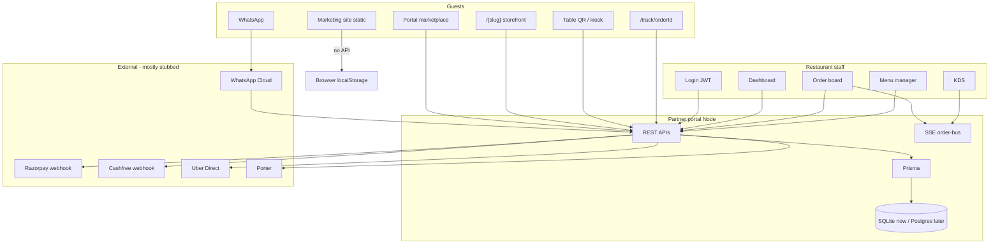

# Fooody.in — Complete Project Inventory & Architecture

**Purpose of this document:** a single briefing you can give to ChatGPT, Cursor, or any engineer to revamp Fooody without guessing. It describes what exists today (as of 21 September 2026, `main` branch), what is real vs mocked, what is unfinished on other branches, and the intended product.

**Repository:** `portfoliobuilders/fooody-in-website` (working name in-repo: Fooody.in).  
**Live brand:** [https://fooody.in](https://fooody.in)  
**Contact in product copy:** `hello@fooody.in`  
**Founder credited in metadata:** Athul Anil / Athul Menon (seed owner name).  
**Build partner credited in footer:** Portfolix.Tech.

---

## 0. How to use this with ChatGPT

Paste this whole file as system/project context. Then ask for one of:

1. **Revamp plan** — a new target architecture that unifies the two apps.
2. **Fix list** — prioritized bugs and stubs to make the current code production-ready.
3. **Rebuild spec** — a greenfield design that keeps the data model and product surfaces but replaces the split-repo/static-vs-server mess.
4. **Feature implementation** — implement one module (POS, payments, WhatsApp, etc.) against the rules below.

**Do not invent a new product.** Fooody is already defined. The revamp should keep:

- Direct restaurant stores at `fooody.in/[slug]` and `[slug].fooody.in`
- ₹0 platform fee for guests, 0% commission as the default kitchen deal
- POS + KDS + QR dine-in + WhatsApp + marketplace in one kitchen OS
- Kerala / Kochi first (BakeTree Palarivattom is the first live tenant)
- Money in **paise** (integers). Never floats for currency.
- Tenant isolation by `restaurantId` from server-side membership, never from the client alone.

**Do not “upgrade” the stack unless asked.** Current stack is Next.js 16 + React 19 + Prisma 6 + Tailwind 4. Postgres/Supabase/Redis/Go are planned, not live on `main`.

---

## 1. What Fooody is

Fooody is Kerala’s 2016 food-tech brand, rebuilt for 2026 as a **direct-ordering platform + restaurant operating system**.

The public promise:

- Guests order from kitchens at **real menu prices**. No Swiggy/Zomato-style platform fee, surge, or packaging markup on the Fooody channel.
- Restaurants get a **branded store** (`fooody.in/your-brand`), QR dine-in, WhatsApp commerce, POS/KDS, inventory, payouts, and optional 3PL — on a **subscription**, not a tax per plate.
- Claim-your-URL funnel: `fooody.in/[slug]`.
- First city: **Kochi**. First kitchen in the OS: **BakeTree Resto Cafe, Palarivattom**.

Positioning vs aggregators (from the marketing site):

| | Aggregators | Fooody |
|---|---|---|
| Commission | 15–30% | 0% default |
| Guest identity | Hidden / rented | Kitchen owns phone + history |
| Brand | Marketplace skin | Own URL, QR, WhatsApp |
| Contracts | Lock-in | Cancel-anytime subscription |
| Delivery | Forced 3PL tax | In-house, Uber Direct, Porter, or Fooody pool |

**Pricing tiers advertised (not billed in software yet):**

1. **Direct Web** — branded store, QR, WhatsApp, 0% commission.
2. **Flagship Channel** — plus custom apps, CRM, POS/KOT.
3. **Group & Multi-outlet** — central brand, fleet/3PL, multi-kitchen routing.

Exact rupee rates are “confirmed on onboarding”. There is **no Stripe/Razorpay subscription billing** in the codebase.

---

## 2. The critical architectural fact

This repository is **two separate Next.js apps that do not share code**.

| App | Folder | Port locally | Runtime | What it actually is |
|---|---|---|---|---|
| Marketing / consumer demo | repo root (`src/`) | 3000 | **Static export** (`output: "export"`) for Hostinger `public_html`. No API routes. | Public Fooody.in website + fake Kochi marketplace UI |
| Partner portal / restaurant OS | `partner-portal/` | 3000 (separate `npm run dev`) | **Node server** with Prisma, APIs, SSE, webhooks | Real multi-tenant POS, storefront, QR, WhatsApp, dispatch |

They share a brand (fonts, crimson `#ef4444` / flame, Plus Jakarta Sans + Inter) and a story (claim `fooody.in/slug`). They do **not** share:

- Database
- Cart
- Auth
- Menu data
- Claim → tenant provisioning
- Deployment target

**This split is the #1 reason the project feels unfinished.** The homepage cart cannot place a real BakeTree order. Claiming `fooody.in/my-cafe` does not create a restaurant in the portal. The portal has its own `/marketplace` that is the real one.

A revamp must decide: **one Next.js app** (recommended) vs keep two apps but **wire them together**.

---

## 3. Repository map

```
fooody-in-website/
├── src/                          # Marketing Next.js app
│   ├── app/                      # Pages (static)
│   ├── components/               # UI + React contexts
│   └── lib/                      # catalog, claim, site copy, format
├── public/                       # Images, .htaccess, webmanifest
├── public_html/                  # Checked-in Hostinger static build
├── scripts/make-pc-package.mjs   # out/ → public_html + zip
├── Fooody.in-website-for-PC.zip  # Offline preview package
├── partner-portal/               # Restaurant OS Next.js app
│   ├── app/                      # Pages + API routes
│   ├── components/
│   ├── lib/
│   ├── prisma/                   # schema, seed, RLS SQL
│   ├── hostinger/                # PHP stub + seed dump target
│   └── scripts/
├── docs/                         # This file
├── .github/workflows/ci.yml
├── package.json                  # Marketing app only
└── README.md
```

Root `tsconfig` and ESLint **exclude** `partner-portal/`. CI runs two jobs.

### Git history that matters

| Commit / PR | What landed on `main` |
|---|---|
| Initial Next app | Empty Create Next App |
| `cursor/fooody-official-website` | Official marketing site |
| `cursor/portfolix-footer` | Portfolix credit + legal pages |
| `cursor/fooody-production-ui` | Consumer ordering UI + claim funnel |
| `cursor/add-partner-portal` | Partner portal subtree merge |
| `cursor/baketree-storefront-menu-qr` | BakeTree branded store + print-ready menu QR |

### Unmerged branches (not on `main` — include in revamp)

| Branch | What it adds |
|---|---|
| `cursor/production-cutover-postgres` | Prisma `postgresql`, first migration (`0001_init`), webhook/OTP hardening, checkout hardening |
| `cursor/multi-entity-inventory-pos` | Organizations / multi-branch inventory, requisitions, counter POS UI, ESC/POS print, rider mobile APIs, SOP inventory deduction |

Treat those as **intended next layers**, not live production.

---

## 4. Tech stack (do not casually change)

### Marketing app

- Next.js **16.3.4** App Router, React **19.2.8**, TypeScript 5
- Tailwind CSS **4** (`@tailwindcss/postcss`)
- Lucide icons
- `next.config.ts`: `output: "export"`, `trailingSlash: true`, `images.unoptimized: true`
- No database, no API routes
- Optional `NEXT_PUBLIC_WAITLIST_WEBHOOK` (Formspree / Make / Zapier)

### Partner portal

- Next.js **16.3.4** App Router + Turbopack dev
- React 19.2.8, TypeScript 5, Tailwind 4
- Prisma **6.19.3** → **SQLite** on `main` (`file:./dev.db`)
- Production intent: **PostgreSQL / Supabase** + `prisma/supabase-rls.sql`
- Auth: custom **JWT cookie** (`jose`, HS256), bcryptjs passwords
- Validation: Zod 4
- UI: Radix primitives, CVA, sonner toasts, next-themes
- QR: `qrcode`
- Dates: `date-fns`
- Money: integer paise helpers in `lib/money.ts`

### Explicitly NOT in production on `main`

Go, Redis (optional Upstash REST, else in-memory Map), native mobile apps, Stripe checkout, Cloudinary uploads, Supabase Auth. Env keys exist as stubs.

---

## 5. Product surfaces (what a user can open)

### 5.1 Marketing site (static)

| URL | What you see | Real or fake |
|---|---|---|
| `/` | Kochi marketplace: location, search, categories, 21 dishes, cart, claim URL | Browse is real static data. Cart checkout is **fake**. Location does **not** filter dishes. |
| `/for-restaurants/` | Pitch, savings calculator, feature grid, pricing, waitlist | Lead capture only |
| `/our-story/` | 2016 founder chronicle + photos | Content |
| `/about/` `/contact/` | Company + Portfolix | Content |
| `/terms/` `/privacy/` `/cookies/` `/disclaimer/` `/refunds/` | Legal | Content |

### 5.2 Partner portal (server)

| URL | Audience | What it does |
|---|---|---|
| `/` | Marketing for the OS | Links to login + demo storefront (`/malabar-kitchen`) |
| `/login` | Staff | Email/password or phone OTP |
| `/partners/register` | New kitchen | Creates restaurant + owner + session |
| `/marketplace` | Guests | Real DB restaurants ranked by rating + ad boost |
| `/{slug}` | Guests | Branded storefront (menu → cart → UPI/COD → track) |
| `/{slug}/kiosk` | Counter | Same storefront, kiosk mode (no delivery, denser grid) |
| `/{slug}/table/{n}` | Dine-in | Opens table session, locks channel to DINE_IN |
| `/qr/{slug}/table/{n}` | Dine-in QR | Same as table URL |
| `/track/{orderId}` | Guest | Polls order every 5s |
| `/dashboard` | Staff | Restaurant picker |
| `/dashboard/{restaurantId}` | Staff | Overview KPIs + low stock |
| `.../orders` | POS board | Live orders, SSE, simulate, collect pay, print bill |
| `.../kitchen` | KDS | Columns, advance ACCEPTED → PREPARING → READY |
| `.../menu` | Manager | Categories, items, 86-toggle, image URL |
| `.../tables` | Floor | Zones, tables, QR download |
| `.../reservations` | Host | Create / status |
| `.../payments` | Finance | Gateway totals + CSV |
| `.../inventory` | Kitchen/manager | Raw stock + recipes |
| `.../promotions` | Manager | Coupons |
| `.../ads` | Manager | Marketplace boost campaigns |
| `.../staff` | Owner only | Invite by email+role (no password set) |
| `.../settings` | Owner/manager | Hours, brand, UPI, WhatsApp, listing, store/kiosk/menu QR |

Subdomain: `http://baketree.localhost:3000` rewrites to `/baketree` via `proxy.ts`.

---

## 6. Marketing site architecture (root `src/`)

### 6.1 Rendering model

Static HTML per route. No SSR data fetching from a backend. All interactivity is client React + `sessionStorage` / `localStorage`.

`PageShell` variants:

- `market` — light canvas `#F8FAFC` (homepage)
- `editorial` — dark luxury shell (story, for-restaurants)
- `LegalPage` — navbar + prose + footer

Global `Providers` nest:

```
LocationProvider → CartProvider → MenuFilterProvider → WaitlistProvider → ClaimProvider
+ WaitlistModal + ClaimModal + CartUI
```

### 6.2 Client state

| Context | Storage key | Behavior |
|---|---|---|
| Cart | `sessionStorage` `fooody_cart_v1` | Qty map, savings vs aggregator price |
| Location | `sessionStorage` `fooody_location_v1` | Header label; claim city; **does not change catalog** |
| Menu filter | React state | Category / veg / fast / rated / kerala / query |
| Waitlist | `localStorage` `fooody_waitlist_v1` | Lead JSON |
| Claim | same waitlist key | “Reserved slug” lead |

Cart checkout UI: sets `checkingOut`, shows “Order ticket sent”. **No payment, no kitchen, no API.**

### 6.3 Catalog (hardcoded)

File: `src/lib/catalog.ts`

- 8 Kochi locations (cosmetic)
- 6 categories: meals, biryani, burgers, grills, coffee-dessert, healthy
- 21 dishes with `price` vs `aggregatorPrice`, rating, ETA, veg flags
- BakeTree dishes are **marketing copies**, not Prisma `MenuItem` rows
- Fee constants only for “you saved” math: platform ₹8/item, packaging ₹12/item

### 6.4 Claim funnel (fake availability)

File: `src/lib/claim.ts`

1. User types slug in `ClaimBanner`.
2. `slugify` + `slugStatus`: empty / short / invalid / reserved / taken / available.
3. `TAKEN_SLUGS` is a hardcoded set (`baketree`, `paragon`, `kfc`, …).
4. `ClaimModal` collects restaurant name, Indian WhatsApp, cuisine type.
5. Saved to localStorage; optional POST to waitlist webhook.
6. UI says `fooody.in/{slug} is reserved`.

**Does not** call `/api/auth/register-restaurant`. **Does not** create DNS.

Reserved-slug lists **differ** between marketing (`src/lib/claim.ts`) and portal (`partner-portal/lib/tenant/host.ts`). Revamp must unify.

### 6.5 Waitlist

`WaitlistForm` fields typically: name, phone, restaurant, city, source. Always localStorage. Webhook only if `NEXT_PUBLIC_WAITLIST_WEBHOOK` was set **at build time**.

### 6.6 SEO

Real: titles, Open Graph, Twitter card, `sitemap.ts`, `robots.ts`, JSON-LD (Organization, WebSite, SoftwareApplication, FAQ), Apache `.htaccess` HTTPS + security headers + `/our-story.html` redirects.

### 6.7 Design tokens

| Token | Hex |
|---|---|
| Obsidian | `#090d16` / header `#0B0F17` |
| Ivory | `#f4efe6` |
| Flame / crimson | `#ef4444` / `#E11D48` |
| Ember | `#f97316` |
| Gold | `#d4af7a` |
| Marketplace canvas | `#F8FAFC` |
| BakeTree brand (portal) | primary `#1F4D32`, accent `#C4A35A`, bg `#F6EDE0` |

Fonts: Plus Jakarta Sans (display), Inter (body).

---

## 7. Partner portal architecture

### 7.1 Layering

```
Browser (storefront / dashboard / kiosk / QR)
    ↓ fetch / SSE
Next.js App Router
    ├── proxy.ts          subdomain rewrite + dashboard cookie gate
    ├── app/api/*         HTTP + webhooks
    ├── lib/auth          JWT session + RBAC
    ├── lib/db/*          Prisma use-cases (orders, menu, …)
    ├── lib/dispatch/*    3PL / in-house
    ├── lib/whatsapp/*    Cloud API commerce
    ├── lib/realtime      in-process EventEmitter + SSE
    └── Prisma Client → SQLite (dev) / Postgres (intended prod)
```

**Rule:** tenant APIs take `restaurantId` from the URL **and** verify `RestaurantMember` (or `User.isSuperAdmin`). Never trust a role sent by the client.

### 7.2 Request proxy (`partner-portal/proxy.ts`)

Next.js 16 “proxy” (replaces classic `middleware.ts`):

1. If host is `{slug}.localhost` or `{slug}.{ROOT_DOMAIN}` → rewrite path to `/{slug}...` (skip `/api`).
2. `/dashboard*` without `fooody_session` cookie → `/login?next=`.
3. `/login` with cookie → `/dashboard`.
4. First path segment in `RESERVED_SLUGS` is not treated as a restaurant slug.

### 7.3 Auth

**Cookie:** `fooody_session`, httpOnly, sameSite=lax, secure in production, 14 days.  
**JWT payload:** `userId`, `name`, `email`, `phone`. Signed with `SESSION_SECRET`.  
**Password login:** bcrypt compare on `User.passwordHash`.  
**OTP:** `OtpChallenge` row, 10 minute expiry, code hashed. Delivery is **not implemented** — demo code `AUTH_DEMO_OTP` default `123456`. Phone `9876543210` is the seeded owner.  
**Register kitchen:** public POST creates owner user + `provisionRestaurant` (hours, tables, domain `{slug}.fooody.in`, menu QR SVG) + session cookie.

Staff invite (`POST .../staff`): upserts a User **without password**. They cannot log in until someone sets a hash (gap).

### 7.4 RBAC

Roles: `SUPER_ADMIN`, `OWNER`, `MANAGER`, `KITCHEN_STAFF`, `BILLING_CASHIER`, `DELIVERY_DRIVER`.

| Allow-list | Roles |
|---|---|
| `MUTATE_ROLES` | super, owner, manager |
| `ORDER_ROLES` | all staff including kitchen + driver |
| `KITCHEN_ROLES` | super, owner, manager, kitchen |
| `CASH_ROLES` | super, owner, manager, cashier |
| `MENU_ROLES` | super, owner, manager |
| `FINANCE_ROLES` | super, owner, manager, cashier |
| `DISPATCH_ROLES` | super, owner, manager, cashier, driver |

Kitchen cannot cancel, settle, or print bill (enforced in order PATCH). Super admin bypasses membership and sees every restaurant.

### 7.5 Tenancy & URLs

- Canonical guest menu: `NEXT_PUBLIC_APP_URL/{slug}` (also encoded into `Restaurant.menuQrSvg`).
- Custom host table `RestaurantDomain` (seeded `baketree.fooody.in`) — stored, but pages resolve by **slug**, not by looking up `RestaurantDomain`.
- Marketplace listing flag: `Restaurant.listedOnMarketplace`.
- Commission: `commissionBps` default **0**. Per-channel `CommissionRule` optional.

---

## 8. Data model (Prisma, source of truth)

File: `partner-portal/prisma/schema.prisma`  
Provider on `main`: **sqlite**.  
Money fields: `*Paise` integers. Tax rates: **basis points** (`taxRateBps`, 500 = 5%). Commission: basis points (`commissionBps`).

### 8.1 Identity

- `User` — email/phone unique, optional password, `isSuperAdmin`
- `OtpChallenge`
- `RestaurantMember` — unique `(restaurantId, userId)`, role

### 8.2 Restaurant

- `Restaurant` — slug unique, city/area/address, GSTIN, UPI VPA, WhatsApp, brand colors, marketplace flags, `nextOrderNumber`, `menuUrl` + `menuQrSvg`
- `RestaurantDomain`
- `OperatingHour` — unique `(restaurantId, weekday)`
- `CommissionRule`

### 8.3 Menu

- `MenuCategory`
- `MenuItem` — `basePricePaise`, `taxRateBps`, `diet` VEG/NON_VEG/EGG, `inStock`, `listedOnStorefront`, `listedOnMarketplace`
- `MenuVariant`
- `ModifierGroup` / `ModifierOption` / `ItemModifierGroup` (M2M)

### 8.4 Inventory

- `InventoryItem` — `onHand`, `lowStockAt`, unit KG/G/L/ML/UNIT
- `RecipeLine` — qty per portion per menu item
- `InventoryMovement` — reasons: ORDER_ACCEPTED, ORDER_CANCELLED, MANUAL_ADJUST, WASTAGE, RECEIVING

Deduction happens when order → **ACCEPTED**, restock on **CANCELLED** if previously deducted.

### 8.5 Floor

- `DiningZone` (INDOOR/OUTDOOR/BAR/PRIVATE)
- `DiningTable` — unique `(restaurantId, number)`, status VACANT/OCCUPIED/BILL_PRINTED/RESERVED, `qrPath`
- `TableSession` — OPEN/CHECKED_OUT/ABANDONED, `cartJson`
- `Reservation`

### 8.6 Orders & money

- `Order` — unique `(restaurantId, orderNumber)`
  - channel: DINE_IN | ONLINE_DELIVERY | TAKEAWAY | SELF_DELIVERY | WHATSAPP
  - status: PENDING → ACCEPTED → PREPARING → READY → DISPATCHED → COMPLETED (+ CANCELLED)
  - money: subtotal, discount, packaging, delivery, platform, gst, gatewayFee, netPayout, total
- `OrderItem` — snapshot title/price; `modifiersJson`
- `Payment` — 1:1 with order; gateways RAZORPAY/CASHFREE/STRIPE/UPI/CASH/CARD; statuses PENDING/PAID/CASH_ON_DELIVERY/FAILED/REFUNDED

### 8.7 Dispatch

- `DeliveryDispatch` — 1:1 with order
  - type: IN_HOUSE | UBER_DIRECT | PORTER | FOOODY_POOL
  - status: QUOTED/ASSIGNED/PICKED_UP/IN_TRANSIT/DELIVERED/FAILED/CANCELLED

### 8.8 WhatsApp

- `WhatsAppCartSession` — unique `(restaurantId, waId)`, `cartJson`, TTL companion in KV

### 8.9 Promotions

- `Coupon` — PERCENTAGE/FLAT, min order, max discount, per-user usage limit, channel
- `CouponRedemption` — **schema exists; createOrder does not write redemptions**
- `AdCampaign` — daily budget / spent today; spent is **not auto-incremented**

---

## 9. Order lifecycle (sacred path)

```
Guest/POS/WhatsApp
    → createOrder()
        allocate nextOrderNumber (row increment)
        price lines (variant + modifiers)
        apply coupon if valid
        GST = sum(line * taxRateBps)
        packaging = ₹15 (1500 paise) unless DINE_IN
        delivery = ₹40 (4000 paise) if delivery channel
        platformFee from CommissionRule or marketplace commissionBps
        gatewayFee = 1.8% of subtotal if paymentStatus PAID
        total = subtotal - discount + packaging + delivery + platform + gst
        netPayout = total - platform - gatewayFee
        create Payment row
        if table: OCCUPIED, close OPEN table sessions
        publish order.created
        notifyOrderPlaced (WhatsApp text or dry-run)

Staff PATCH status
    PENDING → ACCEPTED     deduct recipes, acceptedAt
    ACCEPTED → PREPARING
    PREPARING → READY      dine-in: billPrintedAt; delivery: auto dispatchOrder()
    READY → DISPATCHED
    DISPATCHED → COMPLETED table VACANT
    * → CANCELLED          restock if deducted; table VACANT
```

**Known bug:** `dispatchOrder()` notifies the customer as DISPATCHED but **does not set `Order.status` to DISPATCHED**. Staff still have to advance the ticket.

**Known bug:** coupon discount is applied but **no `CouponRedemption` row**, so usage limits do not work.

Dine-in takeaway/delivery channels for auto-dispatch: `ONLINE_DELIVERY`, `SELF_DELIVERY`, `WHATSAPP` (`isDeliveryChannel`).

### 9.1 Public place-order API

`POST /api/public/storefront/[slug]/orders`

Body (Zod): name, phone, notes, address, tableNumber, coupon, paymentGateway, cashOnDelivery, marketplace, lines[]. Delivery requires address.

Response: `{ order, trackUrl, upiUri, upiQrDataUrl }`.  
UPI deep link built from restaurant `upiVpa` when not cash. **No Razorpay/Cashfree order create.** Guest is expected to pay UPI outside the app; webhook may later mark PAID if configured.

### 9.2 Guest tracking

`GET /api/public/orders/[orderId]` — no auth.  
UI `/track/[orderId]` polls every **5 seconds**. Not SSE.

---

## 10. Channel architecture

Fooody’s product is **one kitchen ticket, many fronts**.

```
                    ┌──────────── Storefront /{slug} ────────────┐
                    │  Welcome: pick Dine-in / Delivery / Takeaway│
Marketplace ───────►│  Menu + cart + coupon + UPI/COD             │
                    └─────────────────┬──────────────────────────┘
                                      │ createOrder
QR table / kiosk ─────────────────────┤
WhatsApp Cloud webhook ───────────────┤
Partner POS "simulate" / future POS ──┤
                                      ▼
                                 Order + Payment
                                      │
                    ┌─────────────────┼─────────────────┐
                    ▼                 ▼                 ▼
                 KDS board      Dispatch (if delivery)  Payments ledger
                    ▼                 ▼
              Inventory deduct   Rider / Uber / Porter
```

### 10.1 WhatsApp commerce

Webhook: `GET/POST /api/webhooks/whatsapp`

- GET: Meta hub challenge (`WHATSAPP_VERIFY_TOKEN`)
- POST: HMAC `x-hub-signature-256`. **If `WHATSAPP_APP_SECRET` unset, signature check passes.**
- Session in Upstash or memory (`wa:cart:{waId}`), 30 min, mirrored to `WhatsAppCartSession`
- Restaurant resolution: existing session → `WHATSAPP_RESTAURANT_SLUG` (default `baketree`) → first marketplace restaurant. **One WhatsApp number cannot route to many kitchens yet.**
- UX: list categories → items → cart → checkout → `createOrder(channel=WHATSAPP)`
- Send path: Graph API v21. Without tokens: `console.log('[whatsapp:dry-run]')`

### 10.2 Dispatch providers

| Type | When | Live? |
|---|---|---|
| IN_HOUSE | default; SELF_DELIVERY; WHATSAPP | Local assign; track URL `/track/{id}`; quote ₹0 |
| UBER_DIRECT | ONLINE_DELIVERY if env keys set | Real API if `UBER_DIRECT_CUSTOMER_ID` + token; else sandbox ₹89 |
| PORTER | if `PORTER_API_KEY` | Real if keyed; else sandbox ₹69 |
| FOOODY_POOL | selectable | **Always simulated** ₹45 / job `pool_*` |

---

## 11. Realtime

`lib/realtime/order-bus.ts` — Node `EventEmitter` keyed `tenant:{restaurantId}`.

Events: `order.created`, `order.updated`, `menu.updated`, `inventory.updated`, `table.updated`, `dispatch.updated`.

SSE: `GET /api/tenant/{id}/orders/stream` (auth + ORDER_ROLES). Heartbeat `ping` 15s.

Consumers: OrderBoard, KdsBoard, TableMatrix, MenuManager.

**Not multi-instance safe.** Two Node processes will not share events. Redis pub/sub is the intended fix (Upstash env already reserved for WhatsApp KV).

---

## 12. Complete API catalog

Base: partner-portal origin, e.g. `http://localhost:3000`.

### Auth (public except `/me`)

| Method | Path | Notes |
|---|---|---|
| POST | `/api/auth/login` | `{ email, password }` → cookie |
| POST | `/api/auth/logout` | clear cookie |
| GET | `/api/auth/me` | session user + memberships |
| POST | `/api/auth/otp/request` | `{ phone }` — no SMS |
| POST | `/api/auth/otp/verify` | `{ phone, code }` |
| POST | `/api/auth/register-restaurant` | kitchen + owner |

### Public

| Method | Path |
|---|---|
| GET | `/api/public/marketplace` |
| GET | `/api/public/storefront/[slug]` |
| POST | `/api/public/storefront/[slug]/orders` |
| GET | `/api/public/orders/[orderId]` |

### Tenant (all `requireMembership`)

| Method | Path |
|---|---|
| GET/POST | `/api/tenant/[restaurantId]/orders` |
| GET/PATCH | `/api/tenant/[restaurantId]/orders/[orderId]` |
| GET/POST | `/api/tenant/[restaurantId]/orders/[orderId]/dispatch` |
| GET | `/api/tenant/[restaurantId]/orders/stream` SSE |
| GET/POST | `/api/tenant/[restaurantId]/menu` |
| PATCH/PUT/DELETE | `/api/tenant/[restaurantId]/menu/[itemId]` |
| GET | `/api/tenant/[restaurantId]/menu-qr` SVG download |
| GET/POST | `/api/tenant/[restaurantId]/inventory` |
| GET | `/api/tenant/[restaurantId]/payments` `?format=csv` |
| GET/POST | `/api/tenant/[restaurantId]/promotions` |
| GET/POST | `/api/tenant/[restaurantId]/ads` |
| GET/POST | `/api/tenant/[restaurantId]/reservations` |
| GET/PATCH | `/api/tenant/[restaurantId]/settings` |
| GET/POST | `/api/tenant/[restaurantId]/staff` OWNER |
| GET/POST | `/api/tenant/[restaurantId]/tables` |
| GET | `/api/tenant/[restaurantId]/tables/[tableId]/qr` |

### Webhooks

| Method | Path |
|---|---|
| GET/POST | `/api/webhooks/whatsapp` |
| POST | `/api/webhooks/razorpay` |
| POST | `/api/webhooks/cashfree` |

If webhook secrets are unset, HMAC **bypasses** (accepts all). Dangerous if exposed.

---

## 13. Seed / demo data

Command: `cd partner-portal && npx prisma db push --force-reset && npx prisma db seed`  
Password for all staff: `Fooody@2026`  
OTP: `9876543210` / `123456`

| Restaurant ID | Slug | Role |
|---|---|---|
| `rst_baketree` | `baketree` | Flagship — ~142 items, 16 categories, tables 1–8, coupon `BAKETREE10`, UPI `baketree@upi`, phone `9895109707` |
| `rst_malabar` | `malabar-kitchen` | Full POS demo (orders, recipes, ads). Portal homepage “Demo storefront” |
| `rst_fortcochin` | `fort-cochin-cafe` | Minimal brunch listing |

Users: `owner@`, `manager@`, `kitchen@`, `cashier@`, `driver@`, `admin@` all `@fooody.in`.

BakeTree address in seed: 43/3906-B, Aiswarya Nagar, Puthiya Road, Palarivattom, Kochi 682025.

---

## 14. Environment variables

### Marketing

```
NEXT_PUBLIC_WAITLIST_WEBHOOK=
```

### Partner portal (`.env.example`)

```
DATABASE_URL=file:./dev.db
SESSION_SECRET=replace-with-a-long-random-string
AUTH_DEMO_OTP=123456
NEXT_PUBLIC_APP_URL=http://localhost:3000
NEXT_PUBLIC_ROOT_DOMAIN=localhost

# Intended prod
NEXT_PUBLIC_SUPABASE_URL=
NEXT_PUBLIC_SUPABASE_ANON_KEY=
SUPABASE_SERVICE_ROLE_KEY=

UPSTASH_REDIS_REST_URL=
UPSTASH_REDIS_REST_TOKEN=

CLOUDINARY_CLOUD_NAME=
CLOUDINARY_API_KEY=
CLOUDINARY_API_SECRET=

RAZORPAY_KEY_ID=
RAZORPAY_WEBHOOK_SECRET=
CASHFREE_WEBHOOK_SECRET=
STRIPE_SECRET_KEY=

WHATSAPP_VERIFY_TOKEN=
WHATSAPP_APP_SECRET=
WHATSAPP_PHONE_NUMBER_ID=
WHATSAPP_ACCESS_TOKEN=
WHATSAPP_GRAPH_VERSION=v21.0
WHATSAPP_RESTAURANT_SLUG=baketree

UBER_DIRECT_CUSTOMER_ID=
UBER_DIRECT_TOKEN=
UBER_DIRECT_BASE_URL=https://api.uber.com/v1/customers
PORTER_API_KEY=
PORTER_API_URL=
```

Unused despite env: Cloudinary, Stripe, Supabase Auth (app uses custom JWT; RLS SQL uses `auth.uid()` — **mismatch**).

---

## 15. Deployment

### Marketing → Hostinger static

1. `npm run build` → `out/`
2. Upload `out/` or `public_html/` into Hostinger `public_html`
3. Apache `.htaccess` already in `public/`
4. `npm run package:pc` rebuilds zip + `public_html` for non-technical preview

**Cannot host the partner portal this way.** Static hosting has no Prisma, no SSE, no webhooks.

### Partner portal → Node host (intended)

1. Switch Prisma `provider` to `postgresql`
2. `npx prisma migrate deploy`
3. Apply `prisma/supabase-rls.sql` (only if using Supabase Auth — currently inconsistent)
4. `npm run build && npm start`
5. Point `fooody.in` and `*.fooody.in` at the Node process
6. Configure WhatsApp / Razorpay / Cashfree webhook URLs

`build:hostinger` in portal package.json still runs prisma push + seed + next build — leftover from a static-host experiment. `lib/hostinger/static-params.ts` is **unused**. `hostinger/api/config.php` is a stub, not an API.

### CI

`.github/workflows/ci.yml`

- `website`: npm ci, typecheck, lint, **build**
- `partner-portal`: npm ci, prisma generate, typecheck, lint — **no `next build`**

---

## 16. Real vs mock cheat sheet

| Capability | Status on `main` |
|---|---|
| Marketing pages, SEO, legal | Real static |
| Marketing cart / checkout | Mock |
| Marketing claim URL | Lead form only |
| Marketing waitlist | localStorage ± webhook |
| Partner register kitchen | Real (Prisma) |
| JWT + RBAC | Real |
| OTP SMS | Mock (fixed demo code) |
| Storefront / kiosk / QR order | Real tickets in DB |
| UPI pay | Deep link + QR image, not a PSP checkout |
| Razorpay / Cashfree | Webhook settle only |
| Stripe | Enum only |
| POS order board + SSE | Real (single Node) |
| KDS | Real |
| Menu CRUD + 86 | Real |
| Inventory recipes deduct on accept | Real |
| Tables + QR PNG | Real |
| Reservations | Real CRUD |
| Coupons | Discount yes; redemption ledger no |
| Ad campaigns | CRUD + ranking boost; spend not metered |
| WhatsApp send | Dry-run without Graph tokens |
| Uber / Porter | Sandbox unless keys |
| Fooody pool riders | Always fake |
| Staff invite login | Broken (no password) |
| Image uploads | Paste URL only |
| Mobile apps | Advertised, not in repo |
| CRM / SMS retention | Advertised, not built |
| Subscription billing | Advertised, not built |
| Custom domain verification | Field exists, not a flow |
| Multi-branch org | Only on unmerged branch |

---

## 17. Known gaps a revamp must fix

These are the honest problems, not style nits.

1. **Two apps, two truths.** Homepage catalog ≠ BakeTree Prisma menu. Claim ≠ `provisionRestaurant`.
2. **Static vs server deploy.** fooody.in can be Hostinger HTML; the OS cannot. Domain strategy is undefined (www vs app vs wildcard).
3. **Payments are incomplete.** No order creation at Razorpay/Cashfree; UPI is honor-system until webhook.
4. **Webhook HMAC bypass** when secrets missing.
5. **Supabase RLS vs custom JWT** will not work together as written (`auth.uid()` vs `usr_*` ids).
6. **SQLite in schema** while README says switch provider for prod. Unmerged postgres branch exists.
7. **SSE EventEmitter** dies across instances / serverless.
8. **Auto-dispatch does not flip order status.**
9. **CouponRedemption unused.**
10. **Ad spend unused.**
11. **Staff invites cannot log in.**
12. **WhatsApp is single-tenant per phone number.**
13. **Reserved slug lists diverge.**
14. **nextOrderNumber increment is racy** on SQLite without a true sequence (read-after-increment uses updated row; concurrent creates can collide). Need `SERIAL`/advisory lock on Postgres.
15. **GST applied on line total before discount** (discount is order-level). Confirm with accountant.
16. **Gateway fee 1.8% of subtotal**, not of total, and only if already PAID at create time.
17. **No tests** (no Jest/Playwright/Vitest in either package.json).
18. **Portal CI does not `next build`.**
19. **Customer PII on public track URL** — anyone with orderId can see name/phone/address.
20. **Demo credentials in README** — fine for local, lethal if prod seed is reused.
21. **Marketing location picker is a lie.** Same 21 dishes everywhere.
22. **Hostinger PHP / static-params leftover** — confusion for future agents.
23. **Product marketing over-promises** apps, CRM, Dunzo/Shadowfax, KOT printers — only a subset exists.

---

## 18. Unmerged work to fold into a revamp

### `cursor/production-cutover-postgres`

- Prisma provider postgresql + `prisma/migrations/0001_init/migration.sql`
- Hardening: OTP, storefront checkout, webhook signature behavior, login form
- Apache `.htaccess` tweaks
- Treat as the **production database cutover** starting point

### `cursor/multi-entity-inventory-pos`

New concepts:

- `BranchOrganization` — group of restaurants
- Inter-branch `InventoryRequisition` (PURCHASE_ORDER / BRANCH_TRANSFER) with approval/dispatch/receive
- Extra movement reasons `BRANCH_TRANSFER_OUT/IN`
- `RiderProfile` + driver shift status
- Inventory alerts
- Counter **POS terminal** UI (`/dashboard/.../pos`)
- ESC/POS print helper (`lib/pos/escpos.ts`) + print API
- Mobile APIs:
  - `/api/mobile/customer/orders/live`
  - `/api/mobile/owner/dashboard/summary`
  - `/api/mobile/rider/orders/available`
  - `/api/mobile/rider/orders/[id]/status`
- SOP inventory deduction module

This is the **group / multi-outlet** tier sketched in marketing pricing. Not merged; schema on `main` has no `organizationId`.

---

## 19. Intended target architecture (recommendation for revamp)

This is the shape the current code is already leaning toward. A revamp should make it explicit.

```
                         *.fooody.in  /  fooody.in
                                    │
                            Next.js (one app)
                                    │
              ┌─────────────────────┼─────────────────────┐
              │                     │                     │
        Public marketing      Guest commerce        Partner OS
        (today: root src)     storefront/QR/WA      dashboard/KDS/POS
              │                     │                     │
              └─────────────── Prisma / Postgres ─────────┘
                                    │
                     Redis (SSE + WhatsApp sessions)
                     Object storage (Cloudinary/S3)
                     Razorpay or Cashfree
                     WhatsApp Cloud API
                     Uber Direct / Porter adapters
```

**Routing suggestion (not implemented):**

| Host | App |
|---|---|
| `fooody.in` | Marketing + marketplace |
| `fooody.in/login`, `/dashboard` | Partner OS |
| `fooody.in/{slug}` | Guest store |
| `{slug}.fooody.in` | Same guest store (rewrite) |
| `fooody.in/api/*` | All APIs |

**Hard rules to preserve**

1. Every money write in a Prisma `$transaction`.
2. Idempotent order/payment webhooks (unique `reference` / nonce).
3. `restaurantId` from membership, not from body.
4. Paise integers.
5. Default commission 0, default guest platform fee 0 unless a `CommissionRule` says otherwise.
6. Content scripts / extensions are **not** part of this product (ignore OmniPiggy-style rules if an agent has those in context).

**Suggested first revamp milestones**

1. Unify apps or reverse-proxy them under one domain.
2. Postgres + real migrations (take the cutover branch).
3. Connect claim/waitlist → `provisionRestaurant`.
4. Homepage marketplace reads Prisma (or drop fake cart).
5. Razorpay/Cashfree **create order** + verify signature (never bypass).
6. Redis for SSE and WhatsApp.
7. Merge POS + multi-branch inventory if BakeTree has more than one counter.
8. Tests for `createOrder`, transitions, inventory, RBAC.
9. Kill Hostinger-static path for anything that takes money.

---

## 20. Local runbook

### Marketing

```bash
npm install
npm run dev          # http://localhost:3000
npm run typecheck && npm run lint && npm run build
```

### Partner portal

```bash
cd partner-portal
npm install
npx prisma db push --force-reset
npx prisma db seed
npm run dev          # http://localhost:3000  (conflicts with marketing if both run)
```

Open:

- Login: `/login`
- BakeTree store: `/baketree`
- Kiosk: `/baketree/kiosk`
- Table 4 QR: `/qr/baketree/table/4`
- Marketplace: `/marketplace`
- Subdomain: `http://baketree.localhost:3000`

Both apps default to port 3000. Run one at a time, or set `-p 3001` on the second.

---

## 21. File index (partner-portal `lib/`)

| File | Responsibility |
|---|---|
| `lib/auth/session.ts` | JWT cookie |
| `lib/auth/rbac.ts` | `requireMembership`, role lists, `HttpError` |
| `lib/db/prisma.ts` | Client singleton |
| `lib/db/orders.ts` | create, transition, inventory delta, collectPayment, printBill |
| `lib/db/menu.ts` | catalog CRUD, public catalog |
| `lib/db/restaurants.ts` | slugify, provision, settings |
| `lib/db/tables.ts` | floor, sessions, reservations |
| `lib/db/inventory.ts` | stock + recipes |
| `lib/db/payments.ts` | ledger + CSV |
| `lib/db/promotions.ts` | coupons, ads, `marketplaceBoost` |
| `lib/dispatch/index.ts` | quote + create |
| `lib/dispatch/providers/*` | in-house, uber, porter, pool |
| `lib/whatsapp/engine.ts` | inbound state machine |
| `lib/whatsapp/client.ts` | Graph send / dry-run |
| `lib/whatsapp/parse.ts` | Meta payload |
| `lib/realtime/order-bus.ts` | EventEmitter |
| `lib/notify/customer.ts` | status WhatsApp |
| `lib/cache/session-store.ts` | Upstash or Map |
| `lib/tenant/host.ts` | reserved slugs, labels, subdomain |
| `lib/qr/menu-qr.ts` | print-ready SVG |
| `lib/money.ts` | paise, GST bps, settleOrderMoney |
| `lib/hostinger/static-params.ts` | unused static IDs |

Marketing `src/lib/`: `site.ts` (copy, cities), `catalog.ts` (dishes), `claim.ts` (slug rules), `format.ts` (INR, Indian mobile).

---

## 22. Demo accounts (local seed only)

| Role | Email | Password |
|---|---|---|
| Owner | owner@fooody.in | Fooody@2026 |
| Manager | manager@fooody.in | Fooody@2026 |
| Kitchen | kitchen@fooody.in | Fooody@2026 |
| Cashier | cashier@fooody.in | Fooody@2026 |
| Driver | driver@fooody.in | Fooody@2026 |
| Super admin | admin@fooody.in | Fooody@2026 |

Never use these in production.

---

## 23. One-page system diagram



---

## 24. What “done” looked like when this was built

The original build sequence:

1. Official Fooody.in marketing site (Kerala story, waitlist, legal).
2. Consumer homepage that *looks* like a food app (Kochi dishes, cart, claim URL).
3. Partner portal OS: multi-tenant Prisma schema, BakeTree seed, POS/KDS, QR, WhatsApp engine, dispatch adapters, marketplace, register-kitchen.
4. BakeTree branding + print-ready menu QR on restaurant create.
5. Isolation so root CI still typechecks the static site without compiling the portal.

It is a **working local demo of a restaurant OS** plus a **deployable marketing website**. It is **not** yet one production system.

A correct revamp starts from that sentence.

---

*Generated from the `main` branch source on 21 September 2026. Unmerged branches are called out in §18. If code and this file disagree, trust the code and update this file.*
